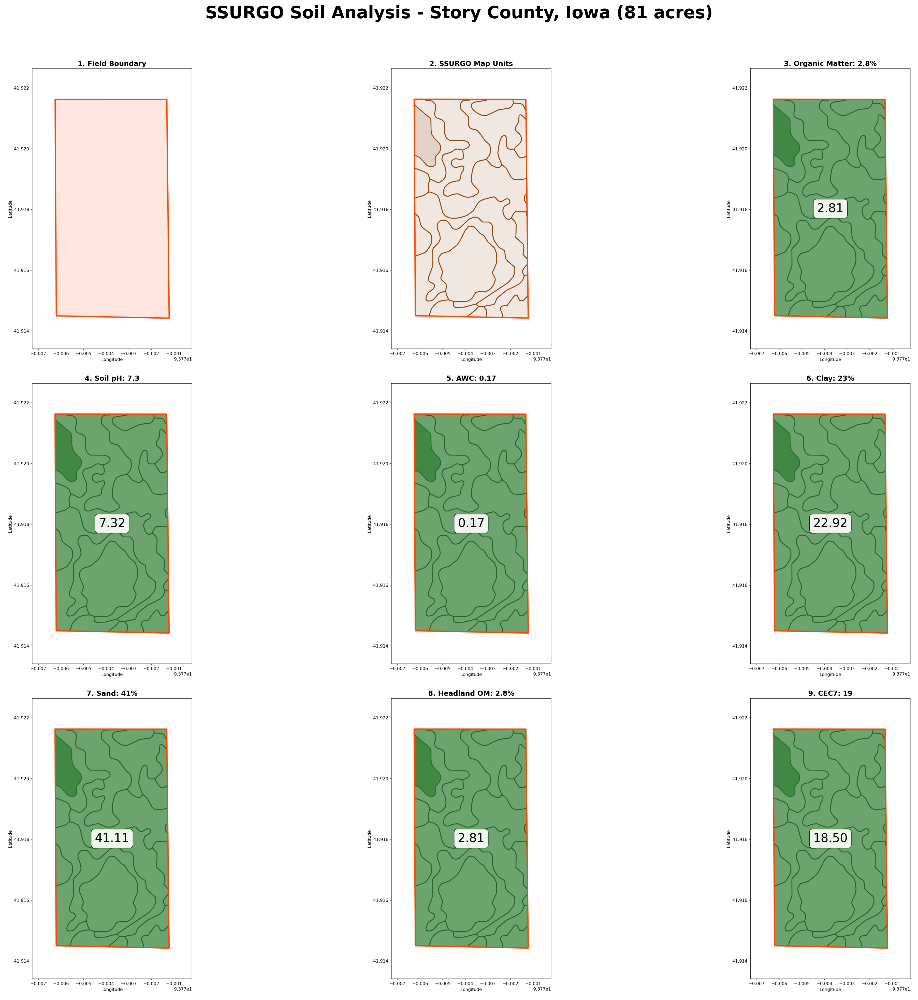

# SSURGO Soil Polygon Analysis Report

## Field Information

| Property         | Value                                             |
| ---------------- | ------------------------------------------------- |
| Location         | Story County, Iowa, USA                           |
| Area             | 81.01 acres                                       |
| Coordinates      | (-93.776263, 41.92163) to (-93.771215, 41.914425) |
| Dominant Soil    | Spillville                                        |
| Drainage Class   | Moderately well drained                           |
| SSURGO Map Units | 9 unique map units                                |
| Soil Polygons    | 19 polygons                                       |

## Soil Properties (Component-Weighted Averages)

| Property                 | Mean Value | Min   | Max   | Units    |
| ------------------------ | ---------- | ----- | ----- | -------- |
| Organic Matter           | 2.81       | 0.99  | 4.97  | %        |
| Soil pH                  | 7.32       | 6.71  | 7.79  | pH       |
| Available Water Capacity | 0.172      | 0.124 | 0.189 | in/in    |
| Clay Content             | 22.9       | 16.0  | 27.8  | %        |
| Sand Content             | 41.1       | 29.1  | 63.6  | %        |
| CEC7                     | 18.5       | 14.3  | 21.8  | meq/100g |

## Maps

### Individual Property Maps

| Property                 | Map File            | Description                             |
| ------------------------ | ------------------- | --------------------------------------- |
| Field Boundary           | field_boundary.png  | Field boundary with 30m headland buffer |
| SSURGO Map Units         | ssurgo_units.png    | Soil polygon boundaries                 |
| Organic Matter           | om_r_map.png        | OM % by map unit (Natural Breaks)       |
| Soil pH                  | ph1to1h2o_r_map.png | pH by map unit (Natural Breaks)         |
| Available Water Capacity | awc_r_map.png       | AWC by map unit (Natural Breaks)        |
| Clay Content             | claytotal_r_map.png | Clay % by map unit (Natural Breaks)     |
| Sand Content             | sandtotal_r_map.png | Sand % by map unit (Natural Breaks)     |
| CEC7                     | cec7_r_map.png      | CEC by map unit (Natural Breaks)        |

_[Image 1]_ = 3x3 panel with all soil attribute maps
_[Image 2-9]_ = Individual property maps (see table above)

## Cartographic Methods

- **Classification**: Natural Breaks (Jenks) optimization with 5 classes
- **Basemap**: Esri World Imagery (satellite)
- **Soil Polygon Transparency**: 45% opacity
- **Coordinate Reference System**: EPSG:3857 (Web Mercator)
- **Headland Buffer**: 30m inward from field boundary (dashed line)
- **Field Boundary**: Bold red (#FF0000), 4px linewidth
- **Map Resolution**: 300 DPI
- **Map Extent**: Fixed to field boundary with 15% margin
- **Cartographic Elements**: Title, legend with class ranges, north arrow, scale bar

## Data Files

| File                   | Description                       |
| ---------------------- | --------------------------------- |
| field_boundary.geojson | Field polygon                     |
| ssurgo_raw.geojson     | Raw SSURGO polygons (19 polygons) |
| ssurgo_clipped.geojson | Clipped to field (19 polygons)    |
| soil_tabular.csv       | Horizon-level data (105 rows)     |
| soil_aggregated.csv    | Mapunit aggregates                |

## Data Sources

- **SSURGO Spatial Data**: USDA Soil Data Access WFS (SDMWGS84GEOGRAPHIC.wfs)
- **SSURGO Tabular Data**: USDA Soil Data Access REST API
- **Satellite Basemap**: Esri World Imagery via contextily

_Generated: 2026-03-12_
