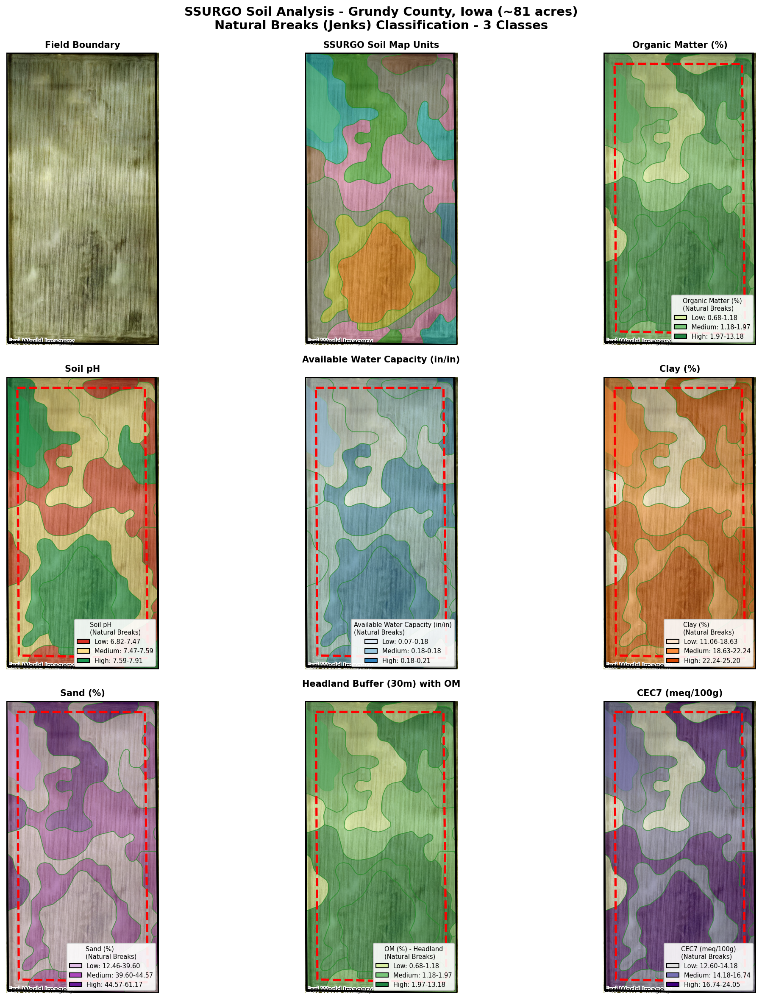

# SSURGO Soil Analysis Report

## Field Overview

- **Location**: Iowa, Grundy County
- **Coordinates**: 41.921630, -93.776263 to 41.914425, -93.771320
- **Field Size**: ~81 acres
- **Data Source**: USDA NRCS Soil Data Access (SDA)

## Summary

This report presents the analysis of SSURGO (Soil Survey Geographic Database) soil 
data for an 80-acre agricultural field in Iowa. The analysis includes soil property 
maps, horizon-level data, and component-weighted averages for key soil characteristics.

## Spatial Visualization

**Figure 1:** 3x3 panel showing:
- Satellite basemap: Esri World Imagery
- Soil polygons: Clipped to field boundary with 50% transparency
- Classification: Natural Breaks (Jenks) with 3 classes
- Polygon outlines: Green (#228B22) at 0.8px
- Field boundary: Black outline at 2.5px
- Headland buffer (30m): Red dashed outline
1. Field boundary (no soil data)
2. SSURGO soil map units
3. Organic Matter (%)
4. Soil pH
5. Available Water Capacity (inches/inch)
6. Clay percentage (%)
7. Sand percentage (%)
8. Headland buffer (30m) with OM overlay
9. CEC7 (meq/100g)

## Map Unit Summary

| Map Unit Key | Soil Name | Symbol | OM (%) | pH | AWC (in/in) | Clay (%) | Sand (%) | CEC7 |
|-------------|-----------|--------|--------|-----|-------------|----------|----------|------|
| 2550272 | Spillville loam, 2 to 5 percent slopes | 485B | 1.84 | 6.82 | 0.184 | 22.7 | 42.7 | 18.7 |
| 2550277 | Blue Earth mucky silt loam, 0 to 1 perce | 511 | 13.18 | 7.65 | 0.210 | 25.2 | 12.5 | 24.0 |
| 2550303 | Zenor sandy loam, 2 to 5 percent slopes | 828B | 0.78 | 7.56 | 0.072 | 11.1 | 61.2 | 12.6 |
| 2550305 | Zenor sandy loam, 5 to 9 percent slopes, | 828C2 | 0.68 | 7.56 | 0.072 | 11.1 | 61.2 | 12.6 |
| 2765522 | Clarion loam, Bemis moraine, 2 to 6 perc | L138B | 0.88 | 7.38 | 0.183 | 17.7 | 46.9 | 13.7 |
| 2834849 | Nicollet loam, 1 to 3 percent slopes | L55 | 1.33 | 7.40 | 0.185 | 19.1 | 43.4 | 14.8 |
| 2835012 | Webster clay loam, Bemis moraine, 0 to 2 | L107 | 2.06 | 7.50 | 0.181 | 22.4 | 38.1 | 17.7 |
| 2835146 | Harps clay loam, Bemis moraine, 0 to 2 p | L95 | 2.06 | 7.91 | 0.185 | 20.9 | 39.6 | 14.4 |
| 2922007 | Canisteo clay loam, Bemis moraine, 0 to  | L507 | 1.93 | 7.83 | 0.180 | 22.1 | 39.5 | 16.2 |

## Key Statistics

### Organic Matter (%)

- Mean: 2.75
- Std Dev: 3.95
- Min: 0.68
- Max: 13.18

### Soil pH

- Mean: 7.51
- Std Dev: 0.31
- Min: 6.82
- Max: 7.91

### Available Water Capacity

- Mean: 0.16
- Std Dev: 0.05
- Min: 0.07
- Max: 0.21

### Clay (%)

- Mean: 19.14
- Std Dev: 5.06
- Min: 11.06
- Max: 25.20

### Sand (%)

- Mean: 42.79
- Std Dev: 14.38
- Min: 12.46
- Max: 61.17

### CEC7 (meq/100g)

- Mean: 16.10
- Std Dev: 3.67
- Min: 12.60
- Max: 24.05

## Soil Properties Table

The following table shows detailed horizon-level data sorted by map unit, depth, 
and component percentage:

| mukey | hzname | Depth (cm) | OM (%) | pH | AWC | Clay (%) | Sand (%) | CEC7 | Comp % |
|-------|--------|------------|--------|-----|-----|----------|----------|------|--------|
| 2550272 | Ap | 0-23 | 3.50 | 6.7 | 0.210 | 24.0 | 40.0 | 20.5 | 90 |
| 2550272 | Ap | 0-20 | 6.00 | 6.7 | 0.210 | 31.0 | 22.0 | 26.4 | 10 |
| 2550272 | A1,A2 | 20-81 | 4.50 | 6.7 | 0.210 | 31.0 | 19.0 | 26.1 | 10 |
| 2550272 | A | 23-112 | 2.50 | 6.7 | 0.180 | 24.0 | 40.0 | 20.3 | 90 |
| 2550272 | AB | 81-102 | 5.50 | 6.7 | 0.170 | 29.0 | 26.7 | 24.8 | 10 |
| 2550272 | Bg1 | 102-112 | 1.50 | 6.7 | 0.150 | 22.0 | 30.0 | 18.4 | 10 |
| 2550272 | C | 112-200 | 0.25 | 7.0 | 0.180 | 20.0 | 50.0 | 15.7 | 90 |
| 2550272 | Bg2 | 112-132 | 1.50 | 6.5 | 0.170 | 22.0 | 30.0 | 18.4 | 10 |
| 2550272 | Cg | 132-152 | 1.00 | 6.7 | 0.150 | 16.0 | 58.0 | 13.6 | 10 |
| 2550277 | Lpco | 0-25 | 17.50 | 7.6 | 0.220 | 25.0 | 7.0 | 26.1 | 85 |
| 2550277 | Ap | 0-23 | 7.00 | 7.5 | 0.180 | 32.0 | 30.0 | 25.0 | 10 |
| 2550277 | Ap | 0-20 | 7.00 | 7.5 | 0.180 | 32.0 | 30.0 | 23.5 | 4 |
| 2550277 | Ap | 0-25 | 7.00 | 7.8 | 0.210 | 15.0 | 50.0 | 12.1 | 1 |
| 2550277 | Ak | 20-41 | 5.00 | 8.0 | 0.180 | 32.0 | 32.0 | 23.2 | 4 |
| 2550277 | A | 23-41 | 5.00 | 7.7 | 0.180 | 32.0 | 32.0 | 25.5 | 10 |
| 2550277 | Lco | 25-173 | 17.50 | 7.6 | 0.220 | 25.0 | 7.0 | 26.1 | 85 |
| 2550277 | A | 25-46 | 5.00 | 7.8 | 0.140 | 15.0 | 55.0 | 12.0 | 1 |
| 2550277 | AB | 41-51 | 3.00 | 7.7 | 0.180 | 32.0 | 32.0 | 25.0 | 10 |
| 2550277 | Bkg | 41-160 | 1.50 | 8.0 | 0.180 | 25.0 | 39.0 | 16.9 | 4 |
| 2550277 | Bg | 46-74 | 1.50 | 7.8 | 0.130 | 10.0 | 65.0 | 7.9 | 1 |
| 2550277 | Bkg | 51-91 | 1.50 | 8.0 | 0.170 | 27.0 | 39.0 | 17.6 | 10 |
| 2550277 | 2Cg | 74-200 | 0.25 | 8.0 | 0.060 | 5.0 | 90.0 | 2.8 | 1 |
| 2550277 | Cg | 91-200 | 0.25 | 8.0 | 0.180 | 21.0 | 44.0 | 15.0 | 10 |
| 2550277 | Cg | 160-200 | 0.25 | 8.0 | 0.180 | 21.0 | 44.0 | 14.3 | 4 |
| 2550277 | 2Cg | 173-200 | 0.25 | 7.6 | 0.190 | 28.0 | 9.0 | 19.9 | 85 |
| 2550303 | H1 | 0-30 | 2.00 | 6.5 | 0.110 | 12.5 | 67.9 | 17.5 | 95 |
| 2550303 | H1 | 0-15 | 2.20 | 7.9 | 0.210 | 22.5 | nan | 17.5 | 5 |
| 2550303 | H2 | 15-152 | 0.25 | 7.9 | 0.180 | 24.0 | nan | 12.5 | 5 |
| 2550303 | H2 | 30-84 | 0.50 | 7.3 | 0.100 | 16.0 | 43.8 | 17.5 | 95 |
| 2550303 | H3 | 84-152 | 0.50 | 8.2 | 0.020 | 5.0 | 79.2 | 6.5 | 95 |

*Table continued: 105 total records*

## Methodology

### Data Sources
- **USDA NRCS Soil Data Access (SDA)**: https://sdmdataaccess.sc.egov.usda.gov/
- **SSURGO Database**: Soil Survey Geographic Database

### Processing Steps
1. Field boundary created from GPS coordinates
2. Map unit keys (mukeys) extracted via SDA spatial intersection
3. Tabular data downloaded: mapunit, component, chorizon tables
4. Horizon properties aggregated using component-weighted averages
5. Natural Breaks (Jenks) classification applied for choropleth maps

### Classification
- **Method**: Natural Breaks (Jenks)
- **Classes**: 3 per property
- **Map Projection**: EPSG:4326 (WGS84), UTM Zone 15N (EPSG:32615) for headland buffer

## Findings

1. **Soil Diversity**: The field contains 9 distinct soil map units
2. **Dominant Soil Types**: 
   - Clarion, Nicollet, Webster, and Harps loams (Bemis moraine)
   - Blue Earth mucky silt loam (poorly drained)
   - Spillville and Zenor loams (steeper slopes)

3. **Organic Matter Range**: 0.68% - 13.18%
   - Blue Earth soils have highest OM (13.18%) due to wetland origin
   - Zenor sandy loams have lowest OM (0.68%)

4. **pH Range**: 6.8 - 7.65
   - Generally neutral to slightly alkaline
   - Suitable for most crops

5. **Available Water Capacity**: 0.07 - 0.21 in/in
   - Blue Earth and Spillville have highest AWC
   - Zenor sandy loams have lowest AWC (drought-prone)

## Data Files

| File | Description |
|------|-------------|
| `field_boundary.geojson` | Field boundary polygon |
| `headland_buffer.geojson` | 30m inward buffer for headland border |
| `ssurgo_raw.geojson` | Raw SSURGO polygons |
| `ssurgo_enriched_correct.geojson` | SSURGO polygons with corrected properties |
| `ssurgo_field_polygons.geojson` | SSURGO polygons clipped to field |
| `soil_properties.csv` | Mapunit-level aggregated properties |
| `soil_summary_table.csv` | Horizon-level detailed data |
| `soil_maps_3x3.png` | 3x3 panel visualization with satellite basemap |

---
*Report generated from USDA NRCS SSURGO data*
